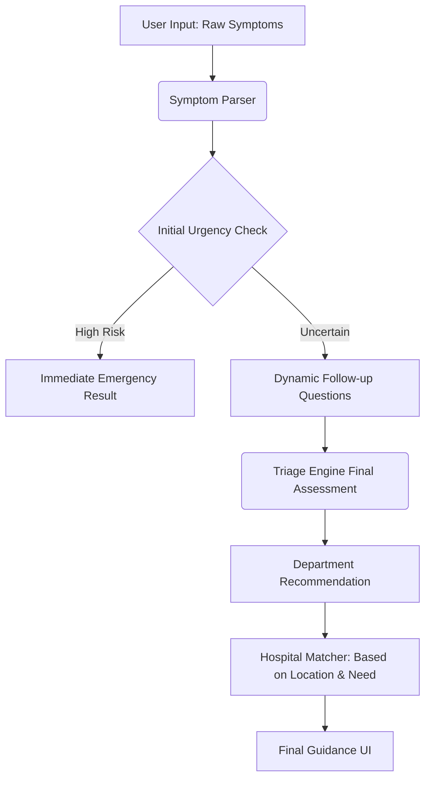

# 🏥 Project Disha: AI-Powered Healthcare Triage for Dhaka

**Disha** is an intelligent healthcare navigation system designed to bridge the gap between symptom onset and professional medical care in Dhaka. Built for the **Impact Dhaka 2026** hackathon, it provides a high-reliability triage engine that guides users through their symptoms to find the right care at the right time.

---

## 🌟 Overview

Navigating the healthcare system in a metropolis like Dhaka can be life-threateningly slow. **Project Disha** simplifies this by:
1.  **Parsing** symptoms from natural language.
2.  **Assessing** urgency via a rule-based triage engine.
3.  **Matching** users with specific departments and hospitals.
4.  **Guiding** via localized, bilingual (Bangla & English) follow-up questions.

---

## ⚙️ How It Works (The Triage Pipeline)



---

## ✨ Key Features

-   **🧠 Adaptive Triage Engine**: Dynamic logic that identifies Emergency (Cardiac/Obstetric), Urgent, and Routine cases.
-   **🗣️ Bilingual Support**: Context-aware questions in both **English** and **Bangla**.
-   **🏨 Smart Hospital Matcher**: Database of 30+ Dhaka hospitals filtered by specialization, emergency capability, and location.
-   **🔍 Semantic Parsing**: Extracts clinical keywords from conversational descriptions.
-   **⚡ Real-time Feedback**: Instant actions and department recommendations.

---

## 🛠️ Tech Stack

-   **Backend**: Flask (Python 3.x)
-   **Logic**: Custom Modular Engines (Triage, Recommendation, Matching, Parsing)
-   **Frontend**: HTML5, Vanilla CSS3 (Modern Aesthetic), JavaScript (Fetch/AJAX)
-   **Deployment**: Procfile-ready for Heroku/Render

---

## 🗺️ Future Roadmap: The Disha Vision

### 📅 Phase 1: Q3 - Q4 | Deep Ecosystem Integration
- **IoT & Wearables Sync**: Real-time vital fetching (SpO2, Heart Rate) to refine triage accuracy.
- **Hyper-Local Mobility API**: Integration with **Pathao/Uber** to pre-book transport for "RED" results.
- **NID / EHR Integration**: Connecting with **DHIS2** to fetch patient history for personalized guidance.

### 📅 Phase 2: | Predictive Public Health (B2G)
- **Epidemic Heatmapping**: Providing DGHS with live heatmaps of infectious spikes (Dengue, Cholera).
- **Pharmacy "Smart-Stock"**: Demand-forecasting for local pharmacies based on regional trends.

### 📅 Phase 3: | Regional & Global Export
- **Inter-City Expansion**: Launching "Disha Sylhet" and "Disha Chittagong".
- **Global Pilot**: Exporting high-density triage logic to other Asian mega-cities (Tokyo, Mumbai).

---

## 💰 Monetization & Freemium Model

### 1. 🟢 Free Tier (Public Service Layer)
- Unlimited Triage & Urgency Classification.
- General Hospital Matching (Govt/Public facilities).
- Emergency Mode (999 dialing & first-aid guidance).

### 2. 🟡 Premium Tier (Individual/Family)
- **Priority Lab Bookings**: Slots at partner labs (Ibn Sina, Popular, Labaid).
- **Personal Health Vault**: Secure storage of digital prescriptions and triage history.
- **Tele-Health Bridge**: One-tap video consultation for "Green" (Home Care) cases.

### 3. 🔵 Enterprise & B2B (Hospital & Corporate)
- **Verified Node Status**: Priority destination status for private hospitals with live bed-count sync.
- **Corporate Wellness**: Triage-as-a-Service for garment factories and corporate offices.

---

## 📁 Project Structure

```bash
Project-Disha/
├── app.py                # Main Flask Application
├── triage_engine.py      # Urgency Assessment Logic
├── symptom_parser.py     # Keyword Extraction
├── hospital_matcher.py   # Filtering & Search Logic
├── recommendation_engine.py # Action Logic
├── hospitals.json        # Dhaka Hospital Dataset
├── templates/            # index.html, questions.html
├── static/               # CSS and Assets
└── requirements.txt      # Dependencies
```

---

## 🛡️ Safety Warning
**Important:** Project Disha is a triage *guidance* tool and not a replacement for professional medical diagnosis. In case of a life-threatening emergency, always contact emergency services or proceed to the nearest hospital immediately.

---

## 🏆 Hackathon Submission
Developed for **Impact Dhaka 2026**.
**Team:** Onigiri
